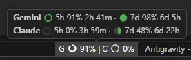

*Read this in [English](README.md) | [한국어](README-ko.md)*

# My Antigravity Usage (Antigravity Lite)

100% 本地化且保护隐私。一款超轻量级（**~30 KB**）的状态栏扩展，可让您一目了然地监控 Antigravity AI 模型的使用配额。无外部网络请求，无 OAuth 认证，无后台进程。

  

## 📸 预览

  

## ✨ 主要功能

- **极简状态栏集成**: 在状态栏中显示直观的环形图表图标和精确的剩余百分比，不会让您的工作区显得拥挤。
- **自定义显示过滤器**: 可通过下拉菜单选择在状态栏上显示哪些 AI 模型（`Gemini`、`Claude & GPT` 或 `All`）。
- **丰富的悬停提示 (Tooltip)**: 将鼠标悬停在状态栏项上即可查看分类精美的配额明细。它并排显示 5 小时环形图和 7 天饼图，并带有准确的剩余百分比和重置倒计时。
- **配额重置警报**: 当您的配额刷新时，立即通过 2 个渠道获得通知：
  1. 💬 **应用内 Toast**: IDE 右下角的弹出通知。
  2. 🔊 **提示音**: Antigravity IDE 内置的任务完成音效。

## 🔒 隐私优先（100% 本地运行）

所有操作均 **100% 在您的计算机上** 运行。扩展程序直接从本地 Antigravity 进程读取配额数据。没有任何请求会离开 `localhost`。

- 没有互联网请求，所有调用都在 `127.0.0.1` 内部
- 无需 Google 身份验证，无需 OAuth，不存储任何令牌
- 绝不向任何服务器发送数据；您的使用习惯完全保密

## 🪶 超轻量级（~30 KB）

通过 `esbuild` 优化，整个扩展程序打包后仅为约 30 KB 的单个 JavaScript 文件。

- 不捆绑 Webview，不使用繁重的 CSS 框架
- 极速启动：加载时间不到 0.1 秒

## ⚙️ 扩展设置

您可以通过 `settings.json` 自定义行为：

| 设置项 | 默认值 | 范围 / 类型 | 说明 |
|---|---|---|---|
| `myAgyUsage.refreshInterval` | `20` | `20-3600` (秒) | 从本地服务器刷新配额数据的时间间隔（秒）。 |
| `myAgyUsage.notifyOnReset` | `true` | `boolean` | 配额刷新时是否显示应用内 Toast 并播放音效。 |
| `myAgyUsage.statusBarModel` | `"all"` | `"all"`, `"gemini"`, `"claudeGpt"` | 过滤要在状态栏上显示的 AI 模型。 |

## ⌨️ 命令

- `Antigravity Usage: Refresh Quota` (`myAgyUsage.refresh`): 立即刷新配额数据。
