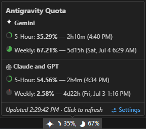

*Read this in [한국어](README-ko.md)*

# My Antigravity Usage (Antigravity Lite)

100% local and private. An ultra-lightweight **(~30 KB)** status bar extension that monitors your Antigravity AI model quota at a glance. No external network calls, no OAuth flows, no background processes.

  

## 📸 Preview

  

## ✨ Key Features

- **Minimalist Status Bar Integration**: Displays intuitive chart icons (ring and pie charts) with exact percentage and countdown timers right in your status bar without cluttering your workspace.
- **Rich Hover Tooltip**: Hover over the status bar item to view a beautifully categorized breakdown of "Gemini" and "Claude/GPT" quotas with exact reset timestamps and countdowns.
- **Multi-Channel Quota Reset Alerts**: When your quota refreshes, get notified immediately across 3 channels:
  1. 🖥️ **OS Desktop Notifications**: Native system toast notification banner.
  2. 💬 **In-App Toast**: IDE popups in the bottom-right corner.
  3. 🔊 **Audio Chimes**: Antigravity IDE built-in task completion sound effect.

## 🔒 Privacy First (100% Local)

Everything runs **100% on your machine**. The extension reads quota data directly from the local Antigravity process. No requests ever leave `localhost`.

- No internet requests, every call stays on `127.0.0.1`
- No Google authentication, no OAuth, no tokens stored
- No data sent to any server; your usage patterns stay completely private

## 🪶 Ultra-Lightweight (~30 KB)

Optimized with `esbuild`, the entire extension is packed into a tiny ~30 KB JavaScript bundle.

- No bundled webviews, no heavy CSS frameworks
- Activates in milliseconds
- Zero external dependencies beyond the VS Code API

## ⚙️ Configuration

| Setting | Default | Range / Type | Description |
|---|---|---|---|
| `myAgyUsage.refreshInterval` | `20` | `20-3600` (seconds) | Interval in seconds to refresh quota data from local server. |
| `myAgyUsage.notifyOnReset` | `true` | `boolean` | Show system notifications, in-app toasts, and play sound effect on quota refresh. |

## ⌨️ Commands

| Command | Keybinding | Description |
|---|---|---|
| `Antigravity Lite: Refresh Quota Data` | `Ctrl/Cmd+Shift+R` | Refresh quota data immediately |

## 🚀 How to Install

1. Open VS Code (or Antigravity) and go to the Extensions view (`Ctrl+Shift+X`).
2. Search for **My Antigravity Usage**.
3. Click **Install**.

## 📄 License

[MIT License](LICENSE)
